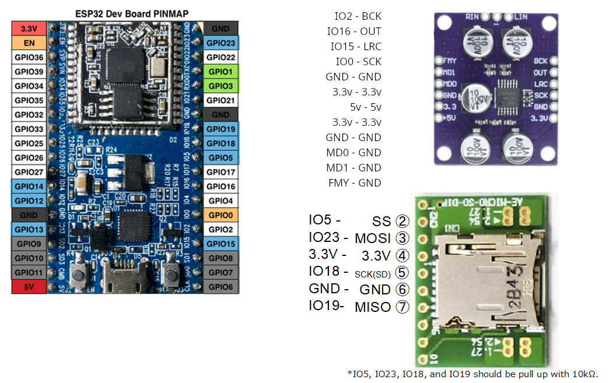

# esp32_SoundRecorder

## Prepare
- [ESP32-DevKitC](https://www.espressif.com/en/products/hardware/esp32-devkitc/overview)  : espressif
- [PCM1808](https://fr.aliexpress.com/i/32830812025.html) : Aliexpress (or similar product using pcm1808)
- [AE-MICRO-SD-DIP](http://akizukidenshi.com/catalog/g/gK-05488/) : Akizuki Denshi (or similar product for micro SD slot)
- resistor 10kΩ x 4 (optionnal)

## Wiring microphone with I2S interface

Note: if you want to change the Esp32 VP pin to another, use [this image](https://lastminuteengineers.com/wp-content/uploads/arduino/ESP32-Development-Board-Pinout.png) and change 
i used information from [this example](https://github.com/espressif/esp-idf/blob/master/examples/peripherals/i2s_adc_dac/main/app_main.c)

## Development Environment
- [PlatformIO](https://platformio.org/)
- [arduino-esp32](https://github.com/espressif/arduino-esp32)

## How to use
Set SD card. Turn on the power. And it starts recording sound and saves as wav file (32bit, monoral, 44.1kHz) in SD card.
